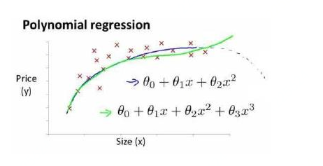
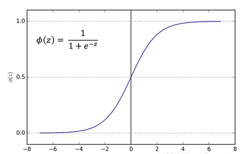

# <center>回归模型</center>

<center> Li Junli 李军利</center>

<center>Apr 20 2019</center>


​	回归分析是一种预测建模技术的方法，研究因变量（目标）和自变量（预测器）之前的关系。这一技术被用在预测、时间序列模型和寻找变量之间的因果关系。回归分析是进行数据建模、分析的重要工具，下图反映的是使用一条曲线来拟合离散数据点。其中，所有离散数据点与拟合曲线对应位置的差值之和是被最小化了的


​	回归分析能估计两个或者多个变量之间的关系，身边很多事情能用到，以我曾经做的一个回归模型为例吧：

​	大四时我曾经在家乡烟台的一家外汇公司学过一段时间的外汇交易，自己尝试着炒外汇赚钱，当时自己还搞了几个时间序列模型和回归模型，我是用回归模型来预测美元指数的，自变量有非农就业人数等，训练好的模型就可以用来估计非农人口与美元指数两个变量的关系和关系强度。

​	（PS：当然由于时效性，政策，心理，预测效果等等原因，模型最终没有派上用场，我最终也没有通过外汇发家致富，尤记得离开公司时对自己说*“军利啊，看来这条致富道路不适合你，还是乖乖去考研究生吧”*，时间像一把快刀，到现在我研究生就快毕业了）	


​	回归分析还可以 在不同尺度上测量的变量的影响，例如价格变化的影响和促销活动的数量的影响。这样的好处是可以帮助市场研究者 / 数据分析家 / 数据科学家评估选择最佳的变量集，用于建立预测模型。


​	线性回归和逻辑回归是使用最多的两种回归模型。还有许多回归模型可以用来做预测。这些回归模型主要由三个度量（独立变量的数量、度量变量的类型和回归线的形状）驱动，每种回归都有其特定的适用场合。本文将介绍 7种常见的回归模型——

​	线性回归（Linear Regression）、逐步回归（Stepwise Regression）、

​	多项式回归（Polynomial Regression）、岭回归（Ridge Regression）、套索回归（Lasso Regression）、 

​	弹性回归（ElasticNet Regression）、逻辑回归（Logistic Regression）。


## 1. 线性回归

​	线性回归是确定两种或两种以上变量间相互依赖的定量关系的一种统计分析方法，运用十分广泛。其表达形式为y = w'x+e，e为误差服从均值为0的正态分布。 回归分析中，只包括一个自变量和一个因变量，且二者的关系可用一条直线近似表示，这种回归分析称为一元线性回归分析。如果回归分析中包括两个或两个以上的自变量，且因变量和自变量之间是线性关系，则称为多元线性回归分析。


​	线性回归的目标就是寻找参数 a 和 b 的值，一种思想是用梯度下降法对最小二乘法形式的误差函数进行优化。损失函数：
$$
J(\theta) = \frac{1}{2m}\sum_{i=1}^{m}(h_{\theta}(x_i) - y_i)^2
$$
​	使用随机梯度下降（SGD）来确定这些权重和偏置

​	R-square 衡量模型的效果

​	F检验（方差分析）检验回归方程的显著性，一元线性只有一个特征，F检验相当于T检验

​	T检验 检验回归系数的显著性，一元线性，只有一个特征，检验回归系数即是检验回归方程

​	特征选择方法有： 向前选择，向后剔除，**逐步回归**等方法

​	优点：简单，易理解

 	缺点：只能拟合线性关系、预测连续型目标变量（**多项式回归**，**逻辑回归**）；自相关性，异方差性；

​                   多重共线性、过拟合（**变量选择**，**正则化**）；异常值敏感（**处理**）。

​	适用场景：处理数值型数据，并且预测目标数据为连续型数据

​	例如：根据天气中的 CO 和 NO<sub>X</sub>量 推测 O<sub>3</sub>量、收入增长、运输总量、成绩排名、搜索引擎搜索量等场景


## 2. 多项式回归

​	一个回归方程，如果自变量的指数大于 1，则它就是多项式回归方程，它在回归分析中占有重要的地位，因为任一函数都可以分段用多项式来逼近。如下所示：



​	优点：总体上更灵活，可以模拟一些相当复杂的关系，能模拟线性回归不能拟合的非线性可分的数据。

​	缺点：要设置变量的指数，需要一些数据的先验知识才能选择最佳指数，如果指数选择不当，容易过拟合:


## 3. 逐步回归

​	在处理多个自变量时，可以使用这种形式的回归。在这种技术中，自变量的选择是在一个自动的过程中完成的，其中包括非人为操作。自变量的非人工选择是通过观察统计的值，如R-square，t-stats和 AIC 指标，来识别重要的变量。逐步回归通过同时添加/删除基于指定标准的协变量来拟合模型，是向前选择和向后剔除法选择变量的结合。

- 标准逐步回归法做两件事情，即增加和删除变量

- 向前选择法从模型中最显著的预测开始，然后为每一步添加变量。

- 向后剔除法与模型的所有预测同时开始，然后在每一步消除最小显着性的变量。

  这种建模技术的目的是使用最少的预测变量数来最大化预测能力，这也是处理高维数据集的方法之一。


## 4. 岭回归

​	岭回归是一种专用于共线性数据分析的有偏估计回归方法，实质上是一种改良的最小二乘估计法，通过放弃最小二乘法的无偏性，以损失部分信息、降低精度为代价获得的回归系数更为符合实际、更可靠的回归方法，对病态数据的拟合要强于最小二乘法。

​	岭回归损失函数或者说结构风险函数在最小二乘法的基础上加了 L2 正则化：
$$
J(\theta) = \frac{1}{2m}\sum_{i=1}^{m}(h_{\theta}(x_i) - y_i)^2 + \lambda \sum_{j=1}^{n}(\theta _j)^2
$$
​	岭回归的代价函数仍然是一个凸函数，因此可以利用梯度等于0的方式求得全局最优解（正规方程）。

​	适用场景：通常岭回归方程的R平方值会稍低于普通回归分析，但回归系数的显著性往往明显高于普通回归。

​        优点：L2正则化避免过拟合和多重共线性，在存在共线性问题和病态数据偏多的研究中有较大的实用价值。

​	缺点：会保留所有的特征，只是特征的系数变小，模型仍然很复杂，若有一万个特征，模型效果很差。


## 5. Lasso回归

​	Lasso是由1996年Robert Tibshirani首次提出，全称Least absolute shrinkage and selection operator。该方法是一种压缩估计。它通过构造一个惩罚函数得到一个较为精炼的模型，使得它压缩一些回归系数，即强制系数绝对值之和小于某个固定值；L1正则化会使一些回归系数迅速收敛到0，避免过拟合和多重共线性，并达到特征选择的效果。因此保留了子集收缩的优点，是一种处理具有复共线性数据的有偏估计。	

​	结构化风险函数：
$$
J(\theta) = \frac{1}{2m}\sum_{i=1}^{m}(h_{\theta}(x_i) - y_i)^2 + \lambda \sum_{j=1}^{n}|\theta _j|
$$
​	lasso的正则化项不是可导的，梯度方法不行，求解方法有坐标轴下降法和最小角回归法两种。

​	适用场景：适用于稀疏矩阵；样本量比较小，但是指标非常多，即小N大P问题；适用于高维统计。

​			   在实际应用当中，lasso处理的数据往往是DNA数据，变量非常多，通过lasso把对某种疾病有明显

​                           影响的DNA片段找出来；lasso也可以用来选择资产组合等等。

​	优点：Lasso对于数据的要求是极其低的，所以应用程度较广。无论因变量是连续的还是离散的，Lasso都能

​                   处理。除此之外，lasso还能避免线性回归的多重共线性与过拟合问题，并且可以用于变量选择。

​	缺点：lasso的主要问题是，当变量之间相关时，它只保留一个变量，然后其他相关的变量为0，这可能会导

​                   致信息丢失，从而模型的精确性下降。


## 6. Lasso与岭回归

​	**相同点：**

​	(1) 当截距项存在时，都不惩罚截距项

​	(2) 都是有偏的

​	(3) 都要把系数scale后，再进行惩罚，因为 对范式|| beta||求和时，要保证系数的公平性。

​	**区别：**

​	(1)  L1正则与L2正则​     

​	(2) Ridge 惩罚后 每个系数都收缩；Lasso 惩罚后，有的系数直接变成0 其他系数收缩

​	(3) Ridge缩小了系数的值，但没有达到零，这表明没有特征选择功能； Lasso 有变量选择的功能

​	(4) L1范数没有解析解，但L2范数有。这使得L2范数的解可以通过计算得到。然而，L1范数的解具有稀疏性，

​             这使得它可以与稀疏算法一起使用，这使得在计算上更有效率


下面通过一张图像来比较一下岭回归和Lasso回归：


​	上图中，左上方表示L1（图中菱形图案）和代价函数（图中深色椭圆环）；左下方表示L2（椭圆形线圈）和代价函数（图中深色椭圆环）。同一条线上（或同一个环上），表示对应的函数值相同；图案中心分别表示L1，L2范数以及代价函数的最小值位置。

​	右边表示代价函数加上对应的正则化项之后的图像。添加正则化项之后，会影响原来的代价函数的最小值的位置，以及梯度下降时的路线（如果参数调整合适的话，最小值应该在距离原来代价函数最小值附近且与正则化项的图像相交，因为此时这两项在相互约束的情况下都取到最小值，它们的和也最小）。右上图，显示了Lasso回归中参数的变化情况，最终停留在了θ2=0这条线上；右下方的取值由于受到了L2范数的约束，也产生了位移。

​	当正则化项的权重非常大的时候，会产生左侧黄色点标识的路线，最终所有参数都为0，但是趋近原点的方式不同。这是因为对于范数来说，原点是它们的最小值点。


## 7. 弹性回归

​	弹性回归（ElasticNet）是Lasso和Ridge回归技术的混合体。ElasticNet是Lasso回归和岭回归技术的混合体,它使用了L1和L2正则化，也达到了两种技术的效果。当有多个相关的特征时，ElasticNet是很有用的。Lasso 会随机挑选他们其中的一个，而ElasticNet则会选择两个。在Lasso和岭回归之间进行权衡的一个实际优势是，它允许Elastic-Net在循环的情况下继承岭回归的一些稳定性。

​	代价函数或者叫损失函数或结构风险函数：
$$
J(\theta) = \frac{1}{2m}\sum_{i=1}^{m}(h_{\theta}(x_i) - y_i)^2 + r \ \lambda \sum_{j=1}^{n}|\theta _j| + \frac{1-r}{2}\ \lambda \sum_{j=1}^{n}(\theta _j)^2
$$
​	其中r表示L1所占的比例。

- 它鼓励在高度相关变量的情况下的群体效应，而不是像Lasso那样将其中一些置零。当多个特征和另一个特征相关的时候弹性网络非常有用。Lasso 倾向于随机选择其中一个，而弹性网络更倾向于选择两个

- 选择变量的数目没有限制

- 它可以承受双重收缩


## 8. 逻辑回归

​	逻辑回归假设数据服从伯努利分布，通过极大化似然函数的方法，运用梯度下降来求解参数，来达到将数据二分类的目的。在LR中，将线性回归的结果通过sigmoid函数映射到0到1之间，映射的结果刚好可以看做是数据样本点属于某一类的概率，如果结果越接近0或者1，说明分类结果的可信度越高。这样做不仅应用了线性回归的优势来完成分类任务，而且分类的结果是0~1之间的概率，可以据此对数据分类的结果进行打分。输出是默认类别的概率，值域是 [0,1]，然后使用一个阈值强制地让输出结果变成一个二元分类问题。 

​	 sigmoid函数形式为 f(x)=1 ⁄ (1+e^(-x) ) = e^x ⁄ (1+e^x )， 分布如下图所示：




**推导：**

以多元线性回归为例，推导逻辑回归，记线性回归表达式：
$$
z = w_1x_1 + w_2x_2 + ... + w_mx_m = w^Tx + b
$$
sigomid函数作非线性变换：
$$
y = \sigma(z) = h_w(x)\ ; \ y\epsilon(0, 1)
$$
y 的值域是(0, 1)，对于二分类问题，y值可以看作已知x和w的后验概率，即：
$$
p(y=1|x,w)=h_w(x) \ ; \ p(y=0|x,w) = 1-h_w(x)
$$
一般形式：
$$
p(y|x,w) = [h_w(x)]^{y}[1-h_w(x)]^{1-y}
$$
n个样本的极大似然估计：
$$
P = \prod_{i=1}^{n}{p(y_i|x_i,w)} = \prod_{i=1}^{n}[h_w(x_i)]^{y_i}[1-h_w(x_i)]^{1-y_i}
$$
希望P达到最大，取对数：
$$
log\ P = \sum_{i=1}^{n} y_i log[h_w(x_i)] \ + (1-y_i)log[1-h_w(x_i)] 
$$
加上正则化项，代价函数：
$$
J(w) = -[\frac{1}{n}\sum_{i=1}^{n}y_ilog\ h_w(x_i) + (1-y_i)log(1-h_w(x_i))]+\frac{1}{2m} \lambda \sum_{j=1}^{m}w_j^2
$$
上面代价函数前加负号，用梯度下降法更新参数（个人习惯，也可以不加用梯度上升）：
$$
\frac{\partial J(w)}{\partial w_j} = -\frac{1}{n}\sum_{i=1}^{n}[y_i \frac{1}{h_w(x_i)} - (1-y_i) \frac{1}{1-h_w(x_i)}]\frac{\partial h_w(x_i)}{\partial w_j} + \frac{\lambda}{m}  w_j
$$
根据sigmoid导函数的特点，有：
$$
\frac{\partial h_w(x_i)}{\partial w_j}= [h_w(x_i)][1-h_w(x_i)]\frac{\partial z}{\partial w_j} = [h_w(x_i)][1-h_w(x_i)]x_i^j，x_i^j表示w_j对应的第i个样本的第j个值
$$
上式代入代价函数得更新公式：
$$
w_j：= w_j - \alpha[\frac{1}{n} \sum_{i=1}^{n}h_w(x_i) - y_i]x_i^j + \frac{\lambda}{m}  w_j
$$


**优点：**

```
解释性强，输出值自然地落在0到1之间，并且有概率意义，适合需要得到一个分类概率的场景；计算代价不高，LR在时间和内存需求上相当高效，可以应用于分布式数据，并且还有在线算法实现，用较少的资源处理大型数据；对数据中小噪声的鲁棒性很好，并且不会受到轻微的多重共线性的特别影响；拟合出来的参数就代表了每一个特征(feature)对结果的影响，是一个理解数据的好工具。
```

**缺点：**

```
容易欠拟合，因为它本质上是一个线性的分类器（虽然sigmoid可以作用在多项式回归解决非线性问题，但是效果不如很多强大分类器），所以处理不好特征之间相关的情况（严重的多重共线性则可以使用逻辑回归结合L2正则化来解决，但是若要得到一个简约模型，L2正则化并不是最好的选择，因为它建立的模型涵盖了全部的特征。可以利用因子分析或者变量聚类分析等手段来选择代表性的自变量，以减少候选变量之间的相关性）；不能很好地处理大量多类特征；对缺失值敏感；预测结果呈“S”型，因此从log(odds)向概率转化的过程是非线性的，在两端随着log(odds)值的变化，概率变化很小，而中间概率的变化很大，很敏感。 导致很多区间的变量变化对目标概率的影响没有区分度，无法确定阀值；很难处理数据不平衡的问题。
```

**应用场景：**

```
线性可分问题。
LR是解决工业规模问题最流行的算法，在工业应用上，如果需要分类的数据拥有很多有意义的特征，每个特征都对最后的分类结果有或多或少的影响，那么最简单最有效的办法就是将这些特征线性加权，一起参与到决策过程中；
预测是否发生、发生的概率（流失客户预测）；
影响因素分析（找出影响结果的主要因素）考察某单一因素是否为影响某一事件发生与否的因素。

```

**评价效果：**准确率，召回率，混淆(错判)矩阵 等

**参数解释（对变量的评价）:**

发生比(odds)—— ODDS = 事件发生概率/事件不发生的概率=P/(1-P)

发生比率(odds ratio)—— odds ratio = oddsB/oddsA (组B相对于组A更容易发生的比率）

odds ratio大于1或者小于1都有意义，代表自变量的两个分组有差异性，对因变量的发生概率有作用。若等于1的话，该组变量对事件发生概率没有任何作用。

逻辑回归不是对一个独立的因变量本身进行线性拟合，而是对odds的对数进行线性拟合。**X<sub>i</sub>** 正向变动一个单位，发生比变动 **e<sup>w<sub>i</sub></sup>** 个单位，w_i>0,发生比上升。逻辑回归实际上就是以线性回归的形式去逼近事件发生优势比的对数
$$
\frac{p(y=1|x)}{p(y=0|x)} = \frac{g(x)}{1-g(x)} = e^{w^T x}+b
$$

$$
ln(\frac{p}{1-p}) = b + w_1x_1 + w_2x_2 + ...+w_nx_n 
$$


**与SVM比较：**

线性回归做分类，因为考虑了所有样本点到分类决策面的距离，所以在两类数据分布不均匀的时候将导致误差非常大。LR和SVM克服了这个缺点，其中LR将所有数据采用sigmod函数进行了非线性映射，使得远离分类决策面的数据作用减弱；SVM直接去掉了远离分类决策面的数据，只考虑支持向量的影响。但是对于这两种算法来说，在线性分类情况下，如果异常点较多无法剔除的话，LR中每个样本都是有贡献的，最大似然后会自动压制异常的贡献；SVM+软间隔对异常比较敏感，因为其训练只需要支持向量，有效样本本来就不高，一旦被干扰，预测结果难以预料。


## 9. 如何正确选择回归模型

​	当你只知道线性回归和逻辑回归时，选择往往很简单。如果结果是连续的，就使用线性回归。如果是二元的，就使用逻辑回归！然而，在我们的处理中，可选择的越多，选择正确的一个就越难。类似的情况下也发生在回归模型中。

​	在多类回归模型中，基于自变量和因变量的类型，数据的维数以及数据的其它基本特征的情况下，选择最合适的技术非常重要。以下是你要选择正确的回归模型的关键因素：

    数据探索是构建预测模型的必然组成部分。在选择合适的模型时，比如识别变量的关系和影响时，它应该首选的一步。
    
    比较适合于不同模型的优点，我们可以分析不同的指标参数，如统计意义的参数，R-square，Adjusted R-square，AIC，BIC以及误差项，另一个是Mallows’ Cp准则。这个主要是通过将模型与所有可能的子模型进行对比（或谨慎选择他们），检查在你的模型中可能出现的偏差。
    
    交叉验证是评估预测模型最好额方法。在这里，将你的数据集分成两份（一份做训练和一份做验证）。使用观测值和预测值之间的一个简单均方差来衡量你的预测精度。
    
    如果你的数据集是多个混合变量，那么你就不应该选择自动模型选择方法，因为你应该不想在同一时间把所有变量放在同一个模型中。
    
    它也将取决于你的目的。可能会出现这样的情况，一个不太强大的模型与具有高度[*]统计学意义的模型相比，更易于实现。


​	除了这7个最常用的回归技术，还有其他模型，如Bayesian、Ecological和Robust回归。


## 声明

本文为个人整理，仅限学习使用，转载请标明作者和来源。


## 参考链接

[线性回归百度百科](<https://baike.baidu.com/item/%E7%BA%BF%E6%80%A7%E5%9B%9E%E5%BD%92/8190345?fr=aladdin>)

[岭回归百度百科](https://baike.baidu.com/item/%E5%B2%AD%E5%9B%9E%E5%BD%92/554917?fr=aladdin)

[回归模型](https://blog.csdn.net/red_stone1/article/details/81122926)

[五种回归模型及其优缺点](http://www.sohu.com/a/249214202_814235)

[多项式回归流程图](https://image.baidu.com/)

[岭回归与Lasso回归](https://www.cnblogs.com/Belter/p/8536939.html)

[线性、Lasso、Ridge的权衡](https://www.jianshu.com/p/7e0f6f90fc4b)

[机器学习](https://www.coursera.org/learn/machine-learning)

[吴恩达机器学习课程](https://study.163.com/course/courseLearn.htm?courseId=1004570029#/learn/video?lessonId=1051268960&courseId=1004570029)


