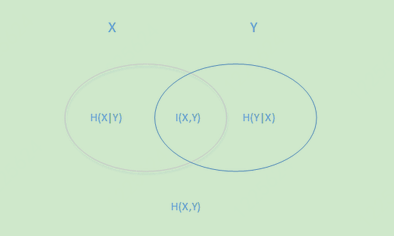
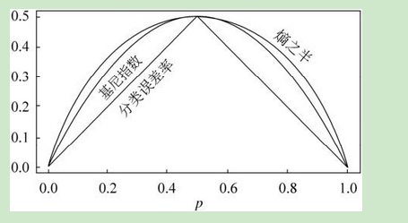
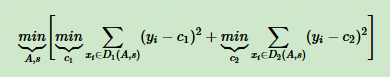
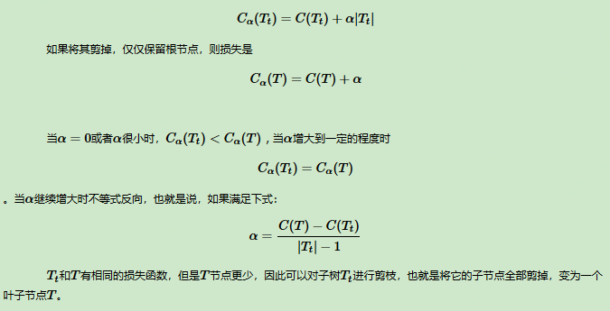
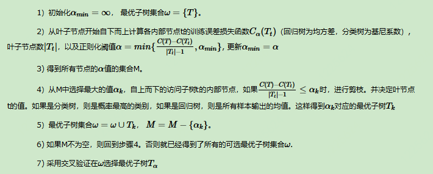

# <center>决策树算法</center>

<center>Li Junli 李军利</center>

<center>Apr 21 2019</center>

​	

​	决策树算法在机器学习中算是很经典的一个算法系列了。它既可以作为分类算法，也可以作为回归算法，同时也特别适合集成学习比如随机森林。本文对决策树算法原理做一个总结，第一章对ID3，C4.5的算法思想做了总结，第二章重点对CART算法做一个详细的介绍。选择CART做重点介绍的原因是scikit-learn使用了优化版的CART算法作为其决策树算法的实现。


## 1. ID3与C4.5算法

​	机器学习算法其实很古老，作为一个码农经常会不停的敲if，else if，else，其实就已经在用到决策树的思想了。只是你有没有想过，有这么多条件，用哪个条件特征先做if，哪个条件特征后做if比较优呢？怎么准确的定量选择这个标准就是决策树机器学习算法的关键了。1970年代，一个叫昆兰的大牛找到了用信息论中的熵来度量决策树的决策选择过程，方法一出，它的简洁和高效就引起了轰动，昆兰把这个算法叫做ID3，后续有很多改进算法，比如C4.5、C5.0 。下面介绍ID3等算法是怎么选择特征的。	


### 1.1 ID3算法的信息论基础

​	首先，我们需要熟悉信息论中熵的概念。熵度量了事物的不确定性，越不确定的事物，它的熵就越大。具体的，随机变量X的熵的表达式如下：
$$
H(X) = -\sum_{i=1}^{n}p_ilog\ p_i
$$
​	其中n代表X的n种不同的离散取值。而pi代表了X取值为i的概率，log为以2或者e为底的对数。举个例子，比如X有2个可能的取值，而这两个取值各为1/2时X的熵最大，此时X具有最大的不确定性。值为:
$$
H(x) = -(\frac{1}{2}log\frac{1}{2} + \frac{1}{2}log\frac{1}{2}) = log2
$$
​	若一个值概率大于1/2，另一个值概率小于1/2，则不确定性减少，对应的熵也会减少。比如一个概率1/3，一个概率2/3，则对应熵为：
$$
H(x) = -(\frac{1}{3}log\frac{1}{3} + \frac{2}{3}log\frac{2}{3}) = log3 - \frac{2}{3}log2<log2
$$
​	熟悉了一个变量X的熵，很容易推广到多个个变量的联合熵，这里给出两个变量X和Y的联合熵表达式：
$$
H(x,y)=-\sum_{i=1}^{n}p(x_i,y_i)log\ p(x_i,y_i)
$$
​	有了联合熵，又可以得到条件熵的表达式H(Y|X)，条件熵类似于条件概率,它度量了我们的Y在知道X以后剩下的不确定性。已知X的条件下，Y的条件熵推导：
$$
H(Y|X) = - \sum_{i=1}^{n}p(x_i)\ H(Y|X=x_i)
$$

$$
= - \sum_{i=1}^{n}p(x_i)\sum_{j=1}^{n}p(y_i|x_i)log\ p(y_i|x_i)
$$

$$
= -\sum_{i=1}^{n}\sum_{j=1}^{n} p(x_i,y_i)log\ p(y_i|x_i)
$$

$$
= -\sum_{i=1}^{n}p(x_i,y_i)log\ p(y_i|x_i)
$$

​	按需求可进一步写为：
$$
= -\sum_{i=1}^{n}p(x_i,y_i)log\ \frac{p(x_i,y_i)}{p(x_i)}
$$

$$
= \sum_{i=1}^{n}p(x_i,y_i)log\ \frac{p(x_i)}{p(x_i,y_i)}
$$


刚才提到H(X)度量了X的不确定性，H(Y)当然度量Y的不确定性，条件熵H(Y|X)度量了在知道X以后Y剩下的不确定性，那么H(Y)-H(Y|X)度量了Y在知道X以后不确定性减少程度，这个度量我们在信息论中称为互信息，记为I(X, Y)。在决策树ID3算法中叫做信息增益。ID3算法就是用信息增益来判断当前节点应该用什么特征来构建决策树。信息增益大，则越适合用来分类。

​	用下面这个图很容易明白他们的关系:



​	左边的椭圆代表H(X)，右边的椭圆代表H(Y)，中间重合的部分就是我们的互信息或者信息增益I(X,Y),  左边的椭圆去掉重合部分就是H(X|Y)，右边的椭圆去掉重合部分就是H(Y|X)。两个椭圆的并就是H(X,Y)。


### 1.2 ID3算法思路

​	上面提到ID3算法就是用信息增益大小来判断当前节点应该用什么特征来构建决策树，用计算出的信息增益最大的特征来建立决策树的当前节点。这里我们举一个信息增益计算的具体的例子。比如我们有15个样本D，输出为0或者1。其中有9个输出为1， 6个输出为0。 样本中有个特征A，取值为A1，A2和A3。在取值为A1的样本的输出中，有3个输出为1， 2个输出为0，取值为A2的样本输出中,2个输出为1,3个输出为0， 在取值为A3的样本中，4个输出为1，1个输出为0。

​	样本D的熵为：
$$
H(D) = - [\frac{9}{15}log2\ \frac{9}{15} + \frac{6}{15}log2\ \frac{6}{15}] = 0.971
$$
​	样本D在特征下的条件熵为：
$$
H(D|A) = \frac{5}{15}H(D_1) + \frac{5}{15}H(D_2) + \frac{5}{15}H(D_3)
$$

$$
=-\frac{5}{15}[\frac{3}{5}log2\ \frac{3}{5} + \frac{2}{5}log2\ \frac{2}{5}] -\frac{5}{15}[\frac{2}{5}log2\ \frac{2}{5} + \frac{3}{5}log2\ \frac{3}{5}] -\frac{3}{15}[\frac{4}{5}log2\ \frac{4}{5}+\frac{1}{5}log2\ \frac{1}{5}]
$$

$$
= 0.888
$$

​	信息增益 I(D, A) = H(D) − H(D|A) = 0.971 - 0.888 = 0.083　　　

​	具体算法过程：

```
1)初始化信息增益的阈值ϵ

2）判断样本是否为同一类输出D'，如果是则返回单节点树T,标记类别为D'

3) 判断特征是否为空，如果是则返回单节点树T，标记类别为样本中输出类别D实例数最多的类别

4）计算A中的各个特征（一共n个）对输出D的信息增益，选择信息增益最大的特征A'

5) 如果F'的信息增益小于阈值ϵ，则返回单节点树T，标记类别为样本中输出类别D实例数最多的类别

6）否则，按特征A'的不同取值A'i将对应的样本输出D分成不同的类别Di。每个类别产生一个子节点。对应特征值 

   A'i， 返回增加了节点的树T。

7）对于所有的子节点，令D=Di,A = A−{A'}递归调用2-6步，得到子树Ti并返回
```


### 1.3 Python3 实现ID3

贴上以前学习时写的一个简单的ID3算法

```python
# -*- coding: utf-8 -*-
"""
Created on Thu Apr  5 21:30:54 2018

@author: Administrator
"""


def calcshannonEnt(dataSet):
    from math import log
    numEntires = len(dataSet)  # 返回数据集的行数
    labelCounts = {}  # 保存每个标签(label)出现次数的字典
    
    for featVec in dataSet:  # 对每组特征向量进行统计
        currentLabel = featVec[-1]  # 提取标签(label)信息
        
        # 如果标签没有放进统计次数的字典，添加进去
        if currentLabel not in labelCounts.keys():  
            labelCounts[currentLabel] = 0
            
        labelCounts[currentLabel] += 1 # label 计数
        
    shannonEnt = 0.0  # 信息熵/经验熵/香农熵
    
    for key in labelCounts:
        # 返回该标签label的概率
        prob = float(labelCounts[key]) / numEntires 
        shannonEnt -=prob * log(prob,2)  # 用公式计算
    return shannonEnt  # 返回熵


def createDataSet():
    dataSet = [[0, 0, 0, 0, 'no'],
               [0, 0, 0, 1, 'no'],
               [0, 1, 0, 1, 'yes'],
               [0, 1, 1, 0, 'yes'],
               [0, 0, 0, 0, 'no'],
               [1, 0, 0, 0, 'no'],
               [1, 0, 0, 1, 'no'],
               [1, 1, 1, 1, 'yes'],
               [1, 0, 1, 2, 'yes'],
               [1, 0, 1, 2, 'yes'],
               [2, 0, 1, 2, 'yes'],
               [2, 0, 1, 1, 'yes'],
               [2, 1, 0, 1, 'yes'],
               [2, 0, 1, 2, 'yes'],
               [2, 0, 0, 0, 'no']]
    
    labels = ['年龄', '有工作', '有自己的房子', '借贷情况']
    return(dataSet, labels)  #返回数据集和分类属性
    
def splitDataSet(dataSet, axis, value):
    retDataset = []  # 创建返回的数据集列表
    for featVec in dataSet:   # 遍历数据集
        if featVec[axis] == value:
            reducedFeatVec = featVec[:axis]   # 去掉axis特征
             # 将符合条件的添加到返回的数据集
            reducedFeatVec.extend(featVec[axis + 1:]) 
            retDataset.append(reducedFeatVec)
            
    return retDataset  # 返回划分后的数据集


def chooseBestFeatureToSplit(dataSet):
    numFeatures = len(dataSet[0]) - 1  # 特征数量
    baseEntropy = calcshannonEnt(dataSet)   # 计算数据集的香农熵
    bestInfoGain = 0.0   # 信息增益
    bestFeature = -1   # 最优特征的索引值
    
    for i in range(numFeatures):   # 遍历所有特征
        # 获取dataset的第i个所有特征-第i列去全部特征
        featList= [example[i] for example in dataSet]   
        uniqueVals = set(featList)   # 创建set集合{}，元素不可重复
        newEntropy = 0.0   # 经验条件熵
        
        for value in uniqueVals:   # 计算信息增益
            # subDataSet划分后的子集
            subDataSet = splitDataSet(dataSet,i,value)  
            # 计算子集的概率
            prob = len(subDataSet) / float(len(dataSet))   
            # 根据公式计算经验条件熵
            newEntropy += prob * calcshannonEnt(subDataSet)  
            
        infoGain = baseEntropy - newEntropy   #信息增益
        # print("第%d个特征的增益为%.3f" % (i,infoGain))
        
        if (infoGain > bestInfoGain):   # 计算信息增益
            bestInfoGain = infoGain   # 更新信息增益，找到最大的信息增益
            bestFeature = i   # 记录信息增益最大的特征的索引值
    
    return bestFeature     # 返回信息增益最大的特征的索引值

# 当特征被划分到只有一个但是依然无法归为一类时即树无法继续构造，此时采用最大投票法，
# 选择最多类别为该类标签
def majorityCnt(classList):
    import operator
    classCount = {}
    
    for vote in classList:   # 统计classList中每个元素出现的次数
        if vote not in classCount.keys(): 
            classCount[vote] = 0
        
        classCount[vote] += 1
        
    # 根据字典的值降序排序        
    sortedClassCount = sorted(classCount.items(), key=operator.itemgetter(1), reverse=True)   
    return sortedClassCount[0][0]  # 返回classList中出现次数最多的元素

# 核心程序：创建树
def createTree(dataSet,labels,featLabels):
    # 取分类标签（是否放贷：yes or no）
    classList = [example[-1] for example in dataSet]    
    # 如果类别相同就停止划分--第一个停止条件
    if classList.count(classList[0]) == len(classList):   
        return classList[0]
        
    # 遍历完所有特征时返回出现次数最多的类标签--第二个停止条件
    if len(dataSet[0]) == 1 :                             
        return(majorityCnt(classList))
        
    bestFeat = chooseBestFeatureToSplit(dataSet)    # 选择最优特征
    bestFeatLabel = labels[bestFeat]                # 最优特征的标签
    featLabels.append(bestFeatLabel)
    myTree = {bestFeatLabel: {}}                    # 根据最优特征的标签生成树
    
    '''
    del (labels[bestFeat]) 函数里最好不要改变列表，而且后面用labels而不是
    featLabels之后，就不能改动列表了，否则索引会对不上
    '''
    # 得到训练集中所有最优特征的属性值
    featValues = [example[bestFeat] for example in dataSet]   
    uniqueVals = set(featValues)      # 去掉重复的属性值
    for value in uniqueVals:          # 遍历特征，创建决策树
        myTree[bestFeatLabel][value] = \
        createTree(splitDataSet(dataSet,bestFeat,value),labels,featLabels)
        '''
        print(myTree[bestFeatLabel][value])
        注意打印出的顺序，第一次递归出来的值在后面输出，最后一次递归的值在最前面
        输出。说明递归的回溯与递推：
        递推：递归每一次都是基于上一次进行下一次的执行，这叫递推
        回溯：则是在遇到终止条件，则从最后往回返一级一级的把值返回来，这叫回溯
        '''
    return myTree

# 使用决策树执行分类
def classify(inputTree,labels,testVec):  # 资料里是featLabels
    firstStr = next(iter(inputTree))     # 获取决策树结点
    secondDict = inputTree[firstStr]     # 下一个字典
    
    # 如果是featLabels，明显得到的索引不是下一行testVec希望得到的最优索引
    featIndex = labels.index(firstStr)   
    key = testVec[featIndex]       # labels的索引才能与teatVec的索引对上
    value0Feat = secondDict[key]
    
    if isinstance(value0Feat,dict):
        classLabel = classify(value0Feat,labels,testVec)  # featLabels
    else:
        classLabel = value0Feat
    return classLabel

# 决策树的存储
def storeTree(inputTree,filename):
    import pickle
    with open(filename,'wb') as fw:
        pickle.dump(inputTree,fw)

# 读取决策树
def grabTree(filename):
    import pickle
    # 以二进制格式打开一个文件用于只读。文件指针将会放在文件的开头。这是默认模式
    fr = open(filename,'rb')  
    tree = pickle.load(fr)
    fr.close()
    return tree


if __name__ ==  '__main__':
    dataSet, labels = createDataSet()
    print('最优索引值:' + str(chooseBestFeatureToSplit(dataSet)))
    featLabels = []
    myTree = createTree(dataSet,labels,featLabels)
    print(myTree)
    # createPlot(myTree) 可视化
    testVec = [1,0,0,1]        # 测试数据 
    result = classify(myTree,labels,testVec)

    
    if result == 'yes':
        print('放贷')
    if result == 'no':
        print('不放贷')
```


### 1.4 决策树ID3算法的不足

​	ID3算法虽然提出了新思路，但是还是有很多值得改进的地方：

```
1) ID3没有考虑连续特征，比如长度，密度都是连续值，无法在ID3运用。这大大限制了ID3的用途

2) ID3采用信息增益大的特征优先建立决策树的节点。很快就被人发现，在相同条件下，取值比较多的特征比取值少的特征信息增益大。比如一个变量有2个值，各为1/2，另一个变量为3个值，各为1/3，其实他们都是完全不确定的变量，但是取3个值的比取2个值的信息增益大。如果校正这个问题呢？

3) ID3算法对于缺失值的情况没有做考虑

4) 没有考虑过拟合的问题
```

​	ID3 算法的作者昆兰基于上述不足，对ID3算法做了改进，这就是C4.5算法（因为决策树太火爆，他的ID3一出来，别人二次创新，很快就占了ID4， ID5，所以他另辟蹊径，取名C4.0算法，后来的进化版为C4.5算法）。  下一小节介绍下C4.5算法。


### 1.5 决策树C4.5算法的改进

​	上一节说到ID3算法有四个主要的不足，一是不能处理连续特征，第二个就是用信息增益作为标准容易偏向于取值较多的特征，最后两个是缺失值处理的问和过拟合问题。昆兰在C4.5算法中改进了上述4个问题。

​	对于第一个问题，不能处理连续特征， C4.5的思路是将连续的特征离散化。比如m个样本的连续特征A有m个，从小到大排列为：
$$
a_1,a_2,...,a_m；C4.5取相邻样本值的平均数，共取m-1个划分点，第i个点T_i表示为:T_i=\frac{a_i+a_{i+1}}{2}
$$
​	对于这m-1个点，分别计算以该点作为二元分类点时的信息增益。选择信息增益最大的点作为该连续特征的二元离散分类点。比如取到的增益最大的点为a<sub>t</sub>，则小于a<sub>t</sub>的值为类别1，大于a<sub>t</sub>的值为类别2，这样就做到了连续特征的离散化。要注意的是，与离散属性不同的是，如果当前节点为连续属性，则该属性后面还可以参与子节点的产生选择过程。

​	对于第二个问题，信息增益作为标准容易偏向于取值较多的特征的问题。我们引入一个信息增益比的变量I<sub>R</sub>(X, Y)，它是信息增益和特征熵的比值。表达式如下：
$$
I_R(D,A) = \frac{I(A,D)}{H_A(D)}
$$
​	其中D为样本特征输出的集合，A为样本特征，对于特征熵H<sub>A</sub>(D), 表达式如下：
$$
H_A(D) = -\sum_{i=1}^{n} \frac{|D_i|}{|D|}\ log2\ \frac{|D_i|}{|D|}
$$


​	其中n为特征A的类别数， D<sub>i</sub>为特征A的第i个取值对应的样本个数。|D|为样本个数。特征数越多的特征对应的特征熵越大，它作为分母，可以校正信息增益容易偏向于取值较多的特征的问题。

　　

​	对于第三个缺失值处理的问题，主要需要解决的是两个问题，一是在样本某些特征缺失的情况下选择划分的属性，二是选定了划分属性，对于在该属性上缺失特征的样本的处理。对于第一个子问题，对于某一个有缺失特征值的特征A。C4.5的思路是将数据分成两部分，对每个样本设置一个权重（初始可以都为1），然后划分数据，一部分是有特征值A的数据D<sub>1</sub>，另一部分是没有特征A的数据D<sub>2</sub>.   然后对于没有缺失特征A的数据集D<sub>1</sub>来和对应的A特征的各个特征值一起计算加权重后的信息增益比，最后乘上一个系数，这个系数是无特征A缺失的样本加权后所占加权总样本的比例。

　　对于第二个子问题，可以将缺失特征的样本同时划分入所有的子节点，不过将该样本的权重按各个子节点样本的数量比例来分配。比如缺失特征A的样本a之前权重为1，特征A有3个特征值A<sub>1</sub>，A<sub>2</sub>，A<sub>3</sub>。3个特征值对应的无缺失A特征的样本个数为2，3，4。则a同时划分入A<sub>1</sub>，A<sub>2</sub>，A<sub>3</sub>。对应权重调节为2/9,3/9, 4/9。

​	

​	对于第4个问题，C4.5引入了正则化系数进行初步的剪枝。具体方法这里不讨论。下一章讲CART的时候会详细讨论剪枝的思路。除了上面的4点，C4.5和ID3的思路区别不大。


### 1.6 决策树C4.5算法的不足与思考

​	C4.5虽然改进或者改善了ID3算法的几个主要的问题，仍然有优化的空间：

```
1) 由于决策树算法非常容易过拟合，因此对于生成的决策树必须要进行剪枝。剪枝的算法有非常多，C4.5的剪枝方法有优化的空间。思路主要是两种，一种是预剪枝，即在生成决策树的时候就决定是否剪枝。另一个是后剪枝，即先生成决策树，再通过交叉验证来剪枝。后面在下篇讲CART树的时候我们会专门讲决策树的减枝思路，主要采用的是后剪枝加上交叉验证选择最合适的决策树。

2) C4.5生成的是多叉树，即一个父节点可以有多个节点。很多时候，在计算机中二叉树模型会比多叉树运算效率高。如果采用二叉树，可以提高效率。

3) C4.5只能用于分类，如果能将决策树用于回归的话可以扩大它的使用范围。

4) C4.5由于使用了熵模型，里面有大量的耗时的对数运算,如果是连续值还有大量的排序运算。如果能够加以模型简化可以减少运算强度但又不牺牲太多准确性的话，那就更好了。
```


​	这4个问题在CART树里面部分加以了改进。所以如果不考虑集成学习话，在普通的决策树算法里，CART算法算是比较优的算法了。scikit-learn的决策树使用的也是CART算法。


## CART算法

​	1.6 节提到了C4.5算法的不足，比如模型是用较为复杂的熵来度量，使用了相对较为复杂的多叉树，只能处理分类不能处理回归等。对于这些问题， CART算法大部分做了改进。由于CART算法可以做回归，也可以做分类，分别加以介绍，先从CART分类树算法开始，重点比较和C4.5算法的不同点。接着介绍CART回归树算法，重点介绍和CART分类树的不同点。然后讨论CART树的建树算法和剪枝算法。


### 2.1 CART分类树算法的最优特征选择方法

​	ID3算法中我们使用了信息增益来选择特征，信息增益大的优先选择。在C4.5算法中，采用了信息增益比来选择特征，以减少信息增益容易选择特征值多的特征的问题。但是无论是ID3还是C4.5，都是基于信息论的熵模型的，这里面会涉及大量的对数运算。能不能简化模型同时也不至于完全丢失熵模型的优点呢？CART分类树算法使用基尼系数来代替信息增益比，基尼系数代表了模型的不纯度，基尼系数越小，则不纯度越低，特征越好。这和信息增益(比)是相反的。

​	具体的，在分类问题中，假设有K个类别，第k个类别的概率为p<sub>k</sub>, 则基尼系数的表达式为：
$$
Gini(p) = \sum_{k=1}^{K}p_k(1-P_k) = 1- \sum_{k=1}^{K}P_k^2
$$
​	二类分类问题，计算很简单了，如果属于第一个样本输出的概率是p，则基尼系数的表达式为：
$$
Gini(p) = 2p(1-p)
$$
​	对于个给定的样本D,假设有K个类别, 第k个类别的数量为C<sub>k</sub>，则样本D的基尼系数表达式为：
$$
Gini(D) = 1- \sum_{k=1}^{K}(\frac{|C_k|}{|D|})^2
$$
​	特别的，对于样本D，如果根据特征A的某个值a,把D分成D<sub>1</sub>和D<sub>2</sub>两部分，则在特征A的条件下，D的基尼系数表达式为:
$$
Gini(D,A) = \frac{|D_1|}{|D|}Gini(D_1) +  \frac{|D_2|}{|D|}Gini(D_2)
$$


​	比较下基尼系数表达式和熵模型的表达式，二次运算是不是比对数简单很多。尤其是二类分类的计算，更加简单。但是简单归简单，和熵模型的度量方式比，基尼系数对应的误差有多大呢？对于二类分类，基尼系数和熵之半的曲线如下：




​	从上图可以看出，基尼系数和熵之半的曲线非常接近，仅仅在45度角附近误差稍大。因此，基尼系数可以做为熵模型的一个近似替代。而CART分类树算法就是使用的基尼系数来选择决策树的特征。同时，为了进一步简化，CART分类树算法每次仅仅对某个特征的值进行二分，而不是多分，这样CART分类树算法建立起来的是二叉树，而不是多叉树。这样一可以进一步简化基尼系数的计算，二可以建立一个更加优雅的二叉树模型。


### 2.2 CART分类树算法对于连续特征和离散特征处理的改进

​	对于CART分类树连续值的处理问题，其思想和C4.5是相同的，都是将连续的特征离散化。唯一的区别在于在选择划分点时的度量方式不同，C4.5使用的是信息增益比，则CART分类树使用的是基尼系数。

​	比如m个样本的连续特征A有m个，从小到大排列为：
$$
a_1,a_2,...,a_m；C4.5取相邻样本值的平均数，共取m-1个划分点，第i个点T_i表示为:T_i=\frac{a_i+a_{i+1}}{2}
$$
​	对于这m-1个点，分别计算以该点作为二元分类点时的基尼系数。选择基尼系数最小的点作为该连续特征的二元离散分类点。比如取到的增基尼系数最小的点为a<sub>t</sub>，则小于a<sub>t</sub>的值为类别1，大于a<sub>t</sub>的值为类别2，这样就做到了连续特征的离散化。要注意的是，与ID3或者C4.5处理离散属性不同的是，如果当前节点为连续属性，则该属性后面还可以参与子节点的产生选择过程。

​	对于CART分类树离散值的处理问题，采用的思路是不停的二分离散特征。回忆下ID3或者C4.5，如果某个特征A被选取建立决策树节点，如果它有A1,A2,A3三种类别，我们会在决策树上一下建立一个三叉的节点。这样导致决策树是多叉树。但是CART分类树使用的方法不同，他采用的是不停的二分，还是这个例子，CART分类树会考虑把A分成{A1}和{A2,A3}, {A2}和{A1,A3}, {A3}和{A1,A2}三种情况，找到基尼系数最小的组合，比如{A2}和{A1,A3},然后建立二叉树节点，一个节点是A2对应的样本，另一个节点是{A1,A3}对应的节点。同时，由于这次没有把特征A的取值完全分开，后面我们还有机会在子节点继续选择到特征A来划分A1和A3。这和ID3或者C4.5不同，在ID3或者C4.5的一棵子树中，离散特征只会参与一次节点的建立。


### 2.3. CART分类树建立算法的具体流程

​	上面介绍了CART算法的一些和C4.5不同之处，下面看看CART分类树建立算法的具体流程，之所以加上了建立，是因为CART树算法还有独立的剪枝算法这一块，这块在第5节讲。

　　算法输入是训练集D，基尼系数的阈值，样本个数阈值。输出是决策树T。算法从根节点开始，用训练集递归的建立CART树。

```
1) 对于当前节点的数据集为D，如果样本个数小于阈值或者没有特征，则返回决策子树，当前节点停止递归。

2) 计算样本集D的基尼系数，如果基尼系数小于阈值，则返回决策树子树，当前节点停止递归。

3) 计算当前节点现有的各个特征的各个特征值对数据集D的基尼系数，对于离散值和连续值的处理方法和基尼系数的计算见第二节。缺失值的处理方法和上篇的C4.5算法里描述的相同。

4) 在计算出来的各个特征的各个特征值对数据集D的基尼系数中，选择基尼系数最小的特征A和对应的特征值a。根据这个最优特征和最优特征值，把数据集划分成两部分D1和D2，同时建立当前节点的左右节点，做节点的数据集D为D1，右节点的数据集D为D2。

5) 对左右的子节点递归的调用1-4步，生成决策树。
```


​	对于生成的决策树做预测的时候，假如测试集里的样本A落到了某个叶子节点，而节点里有多个训练样本。则对于A的类别预测采用的是这个叶子节点里概率最大的类别。


### 2.4  CART回归树建立算法

​	CART回归树和CART分类树的建立算法大部分是类似的，所以只讨论CART回归树和CART分类树的建立算法不同的地方。首先，要理解，什么是回归树，什么是分类树。两者的区别在于样本输出，如果样本输出是离散值，那么这是一颗分类树。如果果样本输出是连续值，那么那么这是一颗回归树。

​	除了概念的不同，CART回归树和CART分类树的建立和预测的区别主要有下面两点：

​	1)连续值的处理方法不同

　　2)决策树建立后做预测的方式不同

​	对于连续值的处理，我CART分类树采用的是用基尼系数的大小来度量特征的各个划分点的优劣情况。这比较适合分类模型，但于回归模型使用了常见的和方差的度量方式，CART回归树的度量目标是，对于任意划分特征A，对应的任意划分点s两边划分成的数据集D<sub>1</sub>和D<sub>2</sub>，求出使D<sub>1</sub>和D<sub>2</sub>各自集合的均方差最小，同时D<sub>1</sub>和D<sub>2</sub>的均方差之和最小所对应的特征和特征值划分点。表达式为：



其中，c<sub>1</sub>为D<sub>1</sub>数据集的样本输出均值，c<sub>2</sub>为D<sub>2</sub>数据集的样本输出均值。

​	

​	对于决策树建立后做预测的方式，上面讲到了CART分类树采用叶子节点里概率最大的类别作为当前节点的预测类别。而回归树输出不是类别，它采用的是用最终叶子的均值或者中位数来预测输出结果。除了上面提到了以外，CART回归树和CART分类树的建立算法和预测没有什么区别。


###  2.5 CART树算法的剪枝

​	CART回归树和CART分类树的剪枝策略除了在度量损失的时候一个使用均方差，一个使用基尼系数，算法基本完全一样，这里一起来讲。

　　由于决策时算法很容易对训练集过拟合，而导致泛化能力差，为了解决这个问题，我们需要对CART树进行剪枝，即类似于线性回归的正则化，来增加决策树的泛化能力。但是，有很多的剪枝方法，我们应该这么选择呢？CART采用的办法是后剪枝法，即先生成决策树，然后产生所有可能的剪枝后的CART树，然后使用交叉验证来检验各种剪枝的效果，选择泛化能力最好的剪枝策略。

　　也就是说，CART树的剪枝算法可以概括为两步，第一步是从原始决策树生成各种剪枝效果的决策树，第二步是用交叉验证来检验剪枝后的预测能力，选择泛化预测能力最好的剪枝后的数作为最终的CART树。

​	首先看看剪枝的损失函数度量，在剪枝的过程中，对于任意的一刻子树T,其损失函数为：
$$
C_{\alpha}(T_t)= C(T_t) + \alpha|T_t|，α为正则化参数； C(T_t)为训练数据的预测误差；|Tt|是子树T的叶子节点的数量。
$$
​	对于训练误差，分类树是用基尼系数度量，回归树是均方差度量。
$$
\alpha＝０：即没有正则化，原始的生成的CART树即为最优子树
$$

$$
\alpha＝\infty:即正则化强度达到最大，此时由原始的生成的CART树的根节点组成的单节点树为最优子树。
$$

​	当然，这是两种极端情况。一般来说:
$$
\alpha 越大，剪枝越厉害，生成的最优子树相比原生决策树就越偏小。
$$

$$
对于固定的\alpha，一定存在使损失函数C_{\alpha}(T_t)= C(T_t)最小的唯一子树
$$

​	说过剪枝的损失函数度量后，再来看看剪枝的思路，对于位于节点t的任意一颗子树Tt，如果没有剪枝，它的损失是\[ [决策树算法原理下](https://www.cnblogs.com/pinard/p/6053344.html) \]：




​	最后看看CART树的交叉验证策略。上面讲到，可以计算出每个子树是否剪枝的阈值α，如果我们把所有的节点是否剪枝的值α都计算出来，然后分别针对不同的α所对应的剪枝后的最优子树做交叉验证。这样就可以选择一个最好的α，有了这个α，我们就可以用对应的最优子树作为最终结果。

​	CART树的剪枝算法:

​	输入是CART树建立算法得到的原始决策树T

　　输出是最优决策子树Tα

​	算法过程如下[ [决策树算法原理下](https://www.cnblogs.com/pinard/p/6053344.html) \]：




### 2.6 CART算法小结

上面对CART算法做了一个详细的介绍，CART算法相比C4.5算法的分类方法，采用了简化的二叉树模型，同时	特征选择采用了近似的基尼系数来简化计算。当然CART树最大的好处是还可以做回归模型，这个C4.5没有。下表给出了ID3，C4.5和CART的一个比较总结。

| 算法 | 支持模型   | 树结构 | 特征选择         | 连续值处理 | 缺失值处理 | 剪枝   |
| ---- | ---------- | ------ | ---------------- | ---------- | ---------- | ------ |
| ID3  | 分类       | 多叉树 | 信息增益         | 不支持     | 不支持     | 不支持 |
| C4.5 | 分类       | 多叉树 | 信息增益比       | 支持       | 支持       | 支持   |
| CART | 分类，回归 | 二叉树 | 基尼系数，均方差 | 支持       | 支持       | 支持   |


看起来CART算法高大上，主要的缺点如下：

```
1）无论是ID3, C4.5还是CART,在做特征选择的时候都是选择最优的一个特征来做分类决策，但是大多数，分类决策不应该是由某一个特征决定的，而是应该由一组特征决定的。这样决策得到的决策树更加准确。这个决策树叫做多变量决策树(multi-variate decision tree)。在选择最优特征的时候，多变量决策树不是选择某一个最优特征，而是选择最优的一个特征线性组合来做决策。这个算法的代表是OC1，这里不多介绍。

2）如果样本发生一点点的改动，就会导致树结构的剧烈改变。这个可以通过集成学习里面的随机森林之类的方法解决
```


## 3. 决策树算法总结

​	不纠结于ID3, C4.5和 CART，来看看决策树算法作为一个大类别的分类回归算法的优缺点。这部分总结于scikit-learn的英文文档。

​	**优点：**

```
1）简单直观，生成的决策树很直观

2）基本不需要预处理，不需要提前归一化，处理缺失值

3）使用决策树预测的代价是O(log2m)，m为样本数

4）既可以处理离散值也可以处理连续值。很多算法只是专注于离散值或者连续值

5）可以处理多维度输出的分类问题

6）相比于神经网络之类的黑盒分类模型，决策树在逻辑上可以得到很好的解释

7）可以交叉验证的剪枝来选择模型，从而提高泛化能力

8） 对于异常点的容错能力好，健壮性高
```


​	**缺点:**

```
1）决策树算法非常容易过拟合，导致泛化能力不强。可以通过设置节点最少样本数量和限制决策树深度来改进

2）决策树会因为样本发生一点点的改动，就会导致树结构的剧烈改变。这个可以通过集成学习之类的方法解决

3）寻找最优的决策树是一个NP难的问题，我们一般是通过启发式方法，容易陷入局部最优。可以通过集成学习之类的方法来改善

4）有些比较复杂的关系，决策树很难学习，比如异或。这个就没有办法了，一般这种关系可以换神经网络分类方法来解决

5）如果某些特征的样本比例过大，生成决策树容易偏向于这些特征。这个可以通过调节样本权重来改善

```


## 参考链接

[决策树百度百科](https://baike.baidu.com/item/%E5%86%B3%E7%AD%96%E6%A0%91%E7%AE%97%E6%B3%95/8595872?fr=aladdin)

[决策树算法原理上](https://www.cnblogs.com/pinard/p/6050306.html)

[决策树算法原理下](https://www.cnblogs.com/pinard/p/6053344.html)

[维基百科条件熵定义](https://blog.csdn.net/u010041824/article/details/70224597)


## 声明

​	感谢刘建平写作的 决策树算法原理上、下两篇，本文大多参考其中内容，本质相同，只是符号，表达式等方面不同。本文仅供学习使用，转载请标明出处，谢谢合作！

