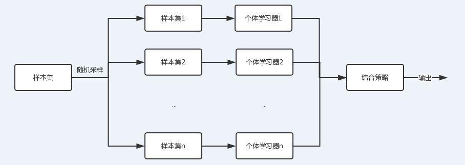
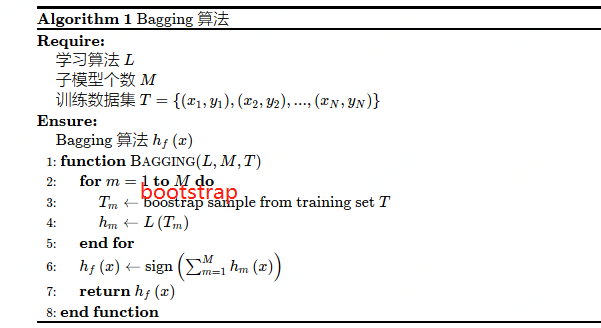
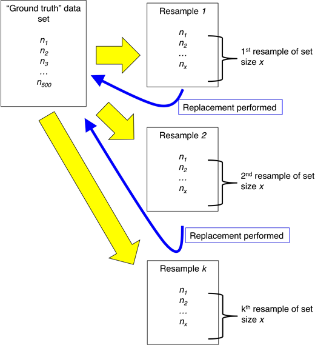
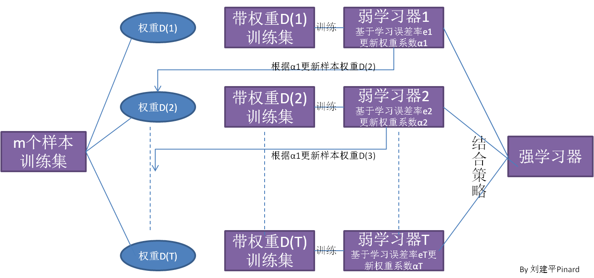
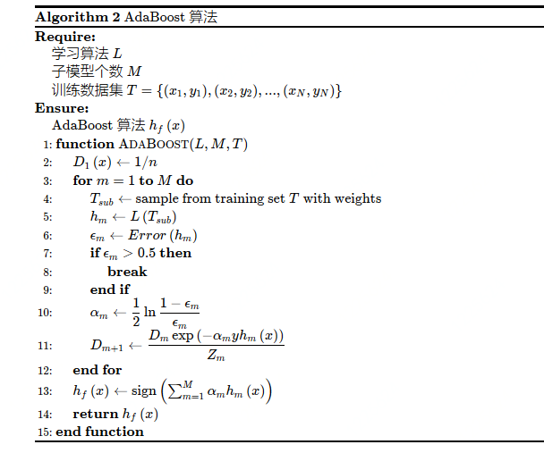
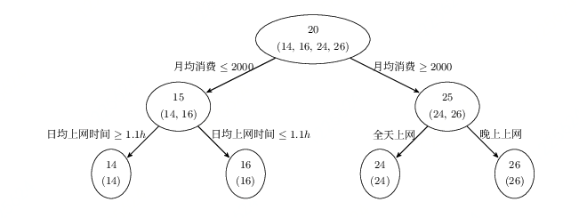
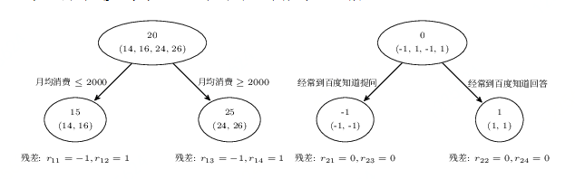
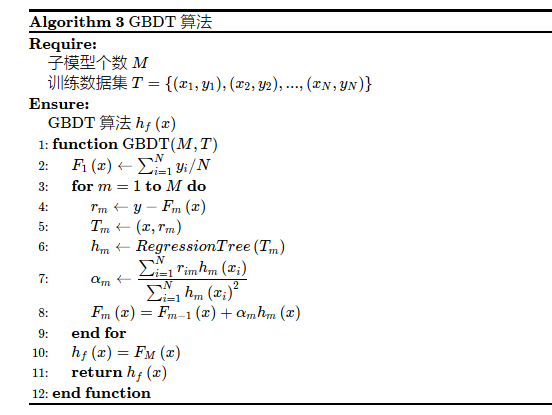

# 集成学习

<center>Li Junli  李军利    /    12th  May  2019</center>   


集成学习(Ensemble Learning)是使用一系列学习器进行学习，并使用某种规则把各个学习结果进行整合从而获得比单个学习器更好的学习效果的一种机器学习方法。一般情况下，集成学习中的多个学习器都是同质的"弱学习器"。基于该弱学习器，通过样本集扰动、输入特征扰动、输出表示扰动、算法参数扰动等方式生成多个学习器，进行集成后获得一个精度较好的"强学习器"。

随着集成学习研究的深入，其广义的定义逐渐被学者们所接受，它是指对多个学习器集合采用学习的方式，而不对学习器性质加以区分。根据这一定义，多学习器系统  (multi-classifier system) 、多专家混合 (mixture of experts) 以及基于委员会的学习  (committee-based learning)等多个领域都可以纳入到集成学习中。但当前仍然以同质分类器的集成学习研究居多。 

集成学习有两个主要的问题需要解决，第一是如何得到若干个**个体学习器**，第二是如何选择一种**结合策略**，将这些个体学习器集合成一个强学习器。

具有代表性的集成学习方法有Boosting（减少偏差），Bagging（减少方差），Stacking（提升预测结果）。


## 1. 理论支持

集成学习的理论基础是 **PAC** 理论、**强可学习**与**弱可学习**理论（**强可学习与弱可学习是等价的，即：一个概念是强可学习的充要条件是这个概念是弱可学习的**）。Kearns和Valiant提出了“强可学习”（strongly learnable）和“弱可学习”（weakly learnable）：在概率近似正确（probably approximately correct，PAC）学习框架下，一个概念如果存在多项式的学习算法学习它，并且正确率很高，那么这个概念就被称为强可学习的；一个概念，如果存在多项式的学习算法学习它，并且正确率只比随机猜测好一点，那么这个概念称为弱可学习的。后来Scphaire证明，强可学习和若可学习是等价的。 

对于分类问题而言，给定一个训练样本，求比较粗糙的分类规则比求精确的分类规则要容易得多。既然强可学习和若可学习是等价的，那么可以通过先找到一些弱分类器，然后寻求将这些弱分类器提升为强分类器的方法，这便是boosting的由来。

具体地，**Thomas G. Dietterich[3-5]**指出了集成算法在统计，计算和表示上的有效原因：

- 统计上的原因

一个学习算法可以理解为在一个假设空间 H 中选找到一个最好的假设。但是，当训练样本的数据量小到不够用来精确的学习到目标假设时，学习算法可以找到很多满足训练样本的分类器。所以，学习算法选择任何一个分类器都会面临一定错误分类的风险，因此将多个假设集成起来可以降低选择错误分类器的风险。

- 计算上的原因

很多学习算法在进行最优化搜索时很有可能陷入局部最优的错误中，因此对于学习算法而言很难得到一个全局最优的假设。事实上人工神经网络和决策树已经被证实为是一 个 NP 问题[6, 7]。集成算法可以从多个起始点进行局部搜索，从而分散陷入局部最优的风险。

- 表示上的原因

在多数应用场景中，假设空间 H 中的任意一个假设都无法表示 (或近似表示) 真正的分类函数 f。因此，对于不同的假设条件，通过加权的形式可以扩大假设空间，从而学习算法可以在一个无法表示或近似表示真正分类函数 f 的假设空间中找到一个逼近函数 f 的近似值。


## 2. 个体学习器

集成学习的第一个问题就是如何得到若干个个体学习器。具体有两种选择。第一种就是所有的个体学习器都是一个种类的，或者说是同质的。比如都是决策树个体学习器，或者都是神经网络个体学习器。第二种是所有的个体学习器不全是一个种类的，或者说是异质的。比如有一个分类问题，对训练集采用支持向量机个体学习器，逻辑回归个体学习器和朴素贝叶斯个体学习器来学习，再通过某种结合策略来确定最终的分类强学习器。

目前来说，同质个体学习器的应用是最广泛的，一般常说的集成学习的方法都是指的同质个体学习器。而同质个体学习器使用最多的模型是CART决策树和神经网络。同质个体学习器按照个体学习器之间是否存在依赖关系可以分为两类，第一个是个体学习器之间存在强依赖关系，一系列个体学习器基本都需要串行生成，代表算法是boosting系列算法，第二个是个体学习器之间不存在强依赖关系，一系列个体学习器可以并行生成，代表算法是bagging系列算法。


## 3. 组合策略

假定第一步找到了 m个弱学习器 {f<sub>1</sub>, f<sub>2</sub>, ... f<sub>m</sub>}，集成学习有3种组合策略。


### 3.1 平均法

对于数值类的回归预测问题，通常使用的结合策略是平均法，也就是说，对于若干个弱学习器的输出进行平均得到最终的预测输出。最简单的平均是算术平均，最终预测是：
$$
F(x) = \frac{1}{m}\sum_{i=1}^{m}f_i(x)
$$
如果每个个体学习器有一个权重w，则最终预测是：
$$
F(x) =\sum_{i=1}^{m}w_if_i(x)
$$
其中wi是个体学习器hi的权重，通常有：
$$
w_i=0，\sum_{i=1}^{m}w_i = 1
$$


### 3.2 投票法

对于分类问题的预测，我们通常使用的是投票法。假设我们的预测类别是{c<sub>1</sub>, c<sub>2</sub>, ..., c<sub>k</sub>}，对于任意一个预测样本x，m个弱学习器的预测结果分别是{f<sub>1</sub>(x), f<sub>2</sub>(x), ... f<sub>m</sub>(x)}。

最简单的投票法是相对多数投票法(少数服从多数)，也就是T个弱学习器的对样本x的预测结果中，数量最多的类别x<sub>i</sub> 为最终的分类类别。如果不止一个类别获得最高票，则随机选择一个做最终类别。

稍微复杂的投票法是绝对多数投票法，也就是我们常说的要票过半数。在相对多数投票法的基础上，不光要求获得最高票，还要求票过半数。否则会拒绝预测。

更加复杂的是加权投票法，和加权平均法一样，每个弱学习器的分类票数要乘以一个权重，最终将各个类别的加权票数求和，最大的值对应的类别为最终类别。


### 3.3 学习法

平均法和投票法 都是对弱学习器的结果做平均或者投票，相对比较简单，但是可能学习误差较大，于是就有了学习法这种方法，对于学习法，代表方法是stacking，当使用stacking的结合策略时， 我们不是对弱学习器的结果做简单的逻辑处理，而是再加上一层学习器，也就是说，我们将训练集弱学习器的学习结果作为输入，将训练集的输出作为输出，重新训练一个学习器来得到最终结果。在这种情况下，弱学习器称为初级学习器，将用于结合的学习器称为次级学习器。对于测试集，首先用初级学习器预测一次，得到次级学习器的输入样本，再用次级学习器预测一次，得到最终的预测结果。


## 4. Bagging

Bagging 和 Boosting 是集成学习的两大流派，Bagging的特点是各个弱学习器间没有依赖关系，可以并行拟合。

随机森林（RF：Random Forest）继承了Bagging思想，并采取了一些优化措施。

随机森林可以很方便的并行训练，在如今大数据，大样本的的时代很有诱惑力。


### 4.1 Bagging原理

Bagging (Boostrap Aggregating) 是由 Breiman于 1996 年提出的[9]。

**基本步骤：**

```
1. 每次采用有放回的抽样从训练集中取出 m个训练样本组成新的训练集。
2. 利用新的训练集，训练得到 n个子模型 {h1,h2,...,hn}。
3. 对于分类问题，采用投票的方法，得票最多子模型的分类类别为最终的类别；对于回归问题，采用简单的平均方法得到预测值。
```


**流程示意图**：




从上图可以看出，Bagging的弱学习器之间的确没有boosting那样的联系。它的特点在“随机采样”。

随机采样(bootsrap)就是从训练集里面采集固定个数的样本，但是每采集一个样本后，都将样本放回。也就是说，之前采集到的样本在放回后有可能继续被采集到。假设训练集样本数为m，Bagging算法，一般会随机采集和训练集样本数m同样个数的样本，这样得到的采样集和训练集样本的个数相同，但是样本内容不同。如果对有m个样本的训练集做n次的随机采样，则由于随机性，n个采样集各不相同。

注意 这与GBDT的子采样是不同的。GBDT的子采样是无放回采样，而Bagging的子采样是放回采样。

对于任意一个样本x，在包含m个样本的训练集的随机采样中：
$$
P(采到x)=\frac{1}{m}；P(没采到x)=1-\frac{1}{m}；\lim_{m\rightarrow+\infty}(1-\frac{1}{m})^{\frac{1}{m}}\rightarrow\frac{1}{e} \approx 0.368
$$
在Bagging的每轮随机采样中，训练集中大约有36.8%的数据没有被采样集采集中，即每个学习器仅用到了训练集中 63.2% 的数据集，剩余的 36.8% 的训练集样本可以用作验证集对于学习器的泛化能力进行包外估计 (out-of-bag estimate)。

**伪代码**[3]：

　　

由于Bagging算法每次都进行采样来训练模型，因此泛化能力很强，对于降低模型的方差很有作用。当然对于训练集的拟合程度就会差一些，也就是模型的偏差会大一些。


### 4.2 Bootstrapping算法

Bagging 第一步的抽样方法采用的就是Bootstrap抽样。

Bootstrapping从字面意思翻译是拔靴法，从其内容翻译又叫自助法，是一种再抽样的统计方法。1977年美国Standford大学统计学教授Efron提出了一种新的增广样本的统计方法，就是Bootstrap方法，为解决小子样试验评估问题提供了很好的思路。

统计学中，bootstrapping可以指依赖于重复随机抽样的一切试验。bootstrapping可以用于计算样本估计的准确性。对于一个采样，我们只能计算出某个统计量(例如均值)的一个取值，无法知道均值统计量的分布情况。但是通过自助法(自举法) 可以模拟出均值统计量的近似分布。

**Bootstrapping的基本思路：**
如果不知道总体分布，那么，对总体分布的最好猜测便是由数据提供的分布。自助法的要点是：①假定观察值便是总体；②由这一假定的总体抽取样本，即再抽样。由原始数据经过再抽样所获得的与原始数据集含量相等的样本称为再抽样样本(resamples)或自助样本(bootstrap samples)。如果将由原始数据集计算所得的统计量称为观察统计量(observed statistic)的话，那么由再抽样样本计算所得的统计量称为自助统计量(bootstrap statistic)。自助法的关键所在是自助统计量与观察统计量间的关系，就如同观察统计量与真值间的关系，可表示为：
自助统计量：：观察统计量<=>观察统计量：：真值。其中，“：：”表示二者间的关系，“<=>”表示等价于。也就是说，通过对自助统计量的研究，就可以了解有关观察统计量与真值的偏离情况。

Bootstrap再抽样是有返还的抽样(sampling with replacement)方式。假定有n个观察值，自助样本可按如下步骤获得：
①将每一观察值写在纸签上；
②将所有纸签放在一个盒子中；
③混匀。抽取一个纸签，记下其上的观察值；
④放回盒子中，混匀，重新抽取；
⑤重复步骤③和④n次，便可得到一个自助样本。重复上述抽样过程B次，便可得到B个自助样本。

**示意图**：




优点：简单易于操作。

缺点：bootstrapping的运用基于很多统计学假设，因此假设的成立与否会影响采样的准确性。


### 4.3 随机森林算法

随机森林(RF：Random Forest)属于Bagging派系，它的思想仍然是bagging，RF使用CART决策树作为弱学习器，

随机森林的“随机” 指**样本随机性**(Bootstrap)和**特征随机性**。随机性，对于降低模型的方差（Low Variance）很有作用，故随机森林一般不需要额外做剪枝，即可以取得较好的泛化能力和抗过拟合能力，当然对于训练集的拟合程度就会差一些，也就是模型的偏差会大一些（High Bias），仅仅是相对的。

一般的CART树会在节点上所有的n个样本特征中选择一个最优的特征来做决策树的左右子树划分，但是RF通过随机选择节点上的一部分样本特征，这个数字小于n，假设为n<sub>sub</sub> ，然后在这些随机选择的n<sub>sub</sub> 个样本特征中，选择一个最优的特征来做决策树的左右子树划分，这样进一步增强了模型的泛化能力，n<sub>sub</sub> 一般默认取特征总数n平方根。如果n<sub>sub</sub> =n，则此时RF的CART决策树和普通的CART决策树没有区别。n<sub>sub</sub> 越小，则模型约健壮，当然此时对于训练集的拟合程度会变差。也就是说n<sub>sub</sub> 越小，模型的方差会减小，但是偏差会增大。在实际案例中，一般会通过交叉验证调参获取一个合适的n<sub>sub</sub> 的值。


RF的优点：

```
1） 训练可以高度并行化，对于大数据时代的大样本训练速度有优势。个人觉得这是的最主要的优点
2） 由于可以随机选择决策树节点划分特征，这样在样本特征维度很高的时候，仍然能高效的训练模型
3） 在训练后，可以给出各个特征对于输出的重要性，得到特征重要性排序 
4） 由于采用了随机采样，训练出的模型的方差小，不容易陷入过拟合，泛化能力强
5） 相对于Boosting系列的Adaboost和GBDT， RF实现比较简单
6） 对部分特征缺失不敏感
7） 既能处理离散型数据，也能处理连续型数据，数据集无需规范化，并且不用做特征选择
```

RF的缺点：

```
1）在某些噪音比较大的样本集上，RF模型容易陷入过拟合。
2) 取值划分比较多的特征容易对RF的决策产生更大的影响，从而影响拟合的模型的效果。
```


RF不需要很多参数调整就可以达到不错的效果，基本上不知道用什么方法的时候都可以先试一下随机森林。


### 4.4 随机森林的推广

由于RF在实际应用中的良好特性，基于RF，有很多变种算法，应用也很广泛，不光可以用于分类回归，还可以用于特征转换，异常点检测等。下面对于这些RF家族的算法中有代表性的做一个总结。

#### 4.4.1 Extra Trees

Extra Trees是RF的一个变种, 原理几乎和RF一模一样，仅有两个区别：

第一 对于每个决策树的训练集，RF采用的是随机采样bootstrap来选择采样集作为每个决策树的训练集，而extra trees一般不采用随机采样，即每个决策树采用原始训练集；

第二  在选定了划分特征后，RF的决策树会基于基尼系数，均方差之类的原则，选择一个最优的特征值划分点，这和传统的决策树相同。但是extra trees比较的激进，他会随机的选择一个特征值来划分决策树。

从第二点可以看出，由于随机选择了特征值的划分点位，而不是最优点位，这样会导致生成的决策树的规模一般会大于RF所生成的决策树。也就是说，模型的方差相对于RF进一步减少，但是偏差相对于RF进一步增大。在某些时候，extra trees的泛化能力比RF更好。


#### 4.4.2 Totally Random Trees Embedding

Totally Random Trees Embedding(以下简称  TRTE)是一种非监督学习的数据转化方法。它将低维的数据集映射到高维，从而让映射到高维的数据更好的运用于分类回归模型。众所周知，在支持向量机中运用了核方法来将低维的数据集映射到高维，此处TRTE提供了另外一种方法。

TRTE在数据转化的过程也使用了类似于RF的方法，建立T个决策树来拟合数据。当决策树建立完毕以后，数据集里的每个数据在T个决策树中叶子节点的位置也定下来了。比如我们有3颗决策树，每个决策树有5个叶子节点，某个数据特征x划分到第一个决策树的第2个叶子节点，第二个决策树的第3个叶子节点，第三个决策树的第5个叶子节点。则x映射后的特征编码为(0,1,0,0,0,      0,0,1,0,0,     0,0,0,0,1), 有15维的高维特征。这里特征维度之间加上空格是为了强调三颗决策树各自的子编码。

映射到高维特征后，可以继续使用监督学习的各种分类回归算法了。


#### 4.4.3 Isolation Forest

Isolation Forest（以下简称IForest）是一种异常点检测的方法。它也使用了类似于RF的方法来检测异常点。

对于在T个决策树的样本集，IForest也会对训练集进行随机采样,但是采样个数不需要和RF一样，对于RF，需要采样到采样集样本个数等于训练集个数。但是IForest不需要采样这么多，一般来说，采样个数要远远小于训练集个数？为什么呢？因为我们的目的是异常点检测，只需要部分的样本我们一般就可以将异常点区别出来了。

对于每一个决策树的建立， IForest采用随机选择一个划分特征，对划分特征随机选择一个划分阈值。这点也和RF不同。另外，IForest一般会选择一个比较小的最大决策树深度max_depth,原因同样本采集，用少量的异常点检测一般不需要这么大规模的决策树。

对于异常点的判断，则是将测试样本点x拟合到T颗决策树。计算在每颗决策树上该样本的叶子节点的深度h<sub>t</sub>(x) ,从而可以计算出平均高度h(x)。此时我们用下面的公式计算样本点x的异常概率:
$$
s(x,m) = 2^{-\frac{h(x)}{c(m)}}
$$
其中，m为样本个数。c(m)的表达式为：
$$
c(m)=2ln(m-1)+\xi - 2\frac{m-1}{m} ，  \xi是欧拉常数
$$
s(x,m)的取值范围是[0,1],取值越接近于1，则是异常点的概率也越大。


## 5. Boosting

Boosting 是一种提升算法，可以将弱的学习算法提升 (boost) 为强的学习算法。基本思路如下：

```
1. 利用初始训练样本集训练得到一个基学习器
2. 根据弱学习器的学习误差率表现来更新训练样本的权重，提高被基学习器误分的样本的权重，使得那些被错误分类
   的样本在下一轮训练中可以得到更大的关注，利用调整后的样本训练得到下一个基学习器
3. 重复上述步骤，直至得到 T个学习器
4. 对于分类问题，采用有权重的投票方式；对于回归问题，采用加权平均得到预测值
```

Boosting基本思想示意图[8]




　

### 5.1 Adaboost

**AdaBoost伪代码**[3]



前文介绍了Boosting算法的基本思想，下面几个具体的问题Boosting算法没有详细说明：

```
1）如何计算学习误差率e?

2) 如何得到弱学习器权重系数α?

3）如何更新样本权重D?

4) 使用何种结合策略？
```

只要是Boosting大家族的算法，都要解决这4个问题。那么Adaboost是怎么解决的呢？


#### 5.1.1 AdaBoost算法基本思路

假设训练集样本
$$
T = \{(x_1,y_1),(x_2,y_2),..., (x_m,y_m) \}
$$
训练集在第k个弱学习器的输出权重为
$$
D_k = (w_{k1},w_{k2},...,w_{km});第一个弱学习器的初始化权重，w_{1i}=\frac{1}{m},i=1,2,...,m
$$
**对于Adaboost的分类问题**：

分类问题的误差率e很好理解和计算。由于多元分类是二元分类的推广，这里假设是二元分类问题，输出为{-1，1}，则第k个弱分类器G<sub>k</sub>(x)在训练集上的加权误差率为
$$
e_k = P(G_k(x_i)\neq y_i) = \sum_{i=1}^{m}w_{ki}I(G_k(x_i)\neq y_i)
$$
接着来看弱学习器权重系数，对于二元分类问题，第k个弱分类器G<sub>k</sub>(x)的权重系数为

$$
\alpha _k = \frac{1}{2} log \frac{1-e_k}{e_k}
$$
为什么这样计算弱学习器权重系数？从上式可以看出，如果分类误差率e<sub>k</sub>越大，则对应的弱分类器权重系数α<sub>k</sub>越小。也就是说，误差率小的弱分类器权重系数越大。具体为什么采用这个权重系数公式，在Adaboost的损失函数优化时详细说明。

第三个问题，更新更新样本权重D，假设第k个弱分类器的样本集权重系数为
$$
D(k) = (w_{k1},w_{k2},...,w_{km})
$$
则对应的第k+1个弱分类器的样本集权重系数为
$$
w_{k+1,i}=\frac{w_{ki}}{Z_k}exp(-\alpha_ky_iG_k{x_i})
$$
其中Z<sub>k</sub>是规范化因子
$$
Z_K = \sum_{i=1}^{m}w_{ki}exp(-\alpha_ky_iG_k{x_i})
$$
从w<sub>k+1,i</sub> 计算公式可以看出，如果第i个样本分类错误，则y<sub>i</sub>G<sub>k</sub>(x<sub>i</sub>) < 0，导致样本的权重在第k+1个弱分类器中增大，如果分类正确，则权重在第k+1个弱分类器中减少。具体为什么采用样本权重更新公式，在Adaboost的损失函数优化时详细说明。

最后一个问题是集合策略。Adaboost分类采用的是加权表决法，最终的强分类器为
$$
f(x) = sign(\sum_{k=1}^{K})\alpha_kG_k(x)
$$


对于Adaboost的回归问题，由于Adaboost的回归问题有很多变种，这里我们以Adaboost R2算法为准：

误差率的问题，第k个弱学习器，计算它在训练集上的最大误差
$$
E_k = max|y_i-G_k(x_i)|,i=1,2,...,m
$$
然后计算每个样本的相对误差
$$
e_{ki}= \frac{|y_i-G_K(x_i)|}{E_k}
$$
这里是误差损失为线性时的情况，如果用平方误差，则
$$
e_{ki}= \frac{(y_i-G_K(x_i))^2}{E_k^2}
$$
如果用的是指数误差，则
$$
e_{ki}=1-exp(\frac{-y_i+G_k(x_i)}{E_K})
$$


最终得到第k个弱学习器的 误差率
$$
e_k =\sum_{i=1}^{m}w_{ki}e_{ki}
$$
到弱学习器权重系数
$$
\alpha_k = \frac{e_k}{1-e_k}
$$
更新更新样本权重D，第k+1个弱学习器的样本集权重系数为
$$
w_{k+1,i} = \frac{w+{ki}}{Z_k} \alpha_k^{1-e_{ki}}
$$
其中Z<sub>k</sub>是规范化因子
$$
Z_k = \sum_{i=1}^{m}w_{ki}\alpha_k^{1-e_{ki}}
$$
最后是结合策略，和分类问题稍有不同，采用的是对加权的弱学习器取权重中位数对应的弱学习器作为强学习器的方法，最终的强回归器为
$$
f(x)=G_{k^*}(x),G_{k^*}(x)是所有 ln(\frac{1}{\alpha_k}),k=1,2,...,K的中位数值对应序号k^*对应的弱学习器
$$


#### 5.1.2 AdaBoost 分类问题的损失函数优化

上一节给出了分类Adaboost的弱学习器权重系数公式和样本权重更新公式。但是没有解释选择这个公式的原因，让人觉得是魔法公式一样，其实它可以从Adaboost的损失函数推导出来。

从另一个角度讲，Adaboost是模型为加法模型，学习算法为前向分步学习算法，分类问题的损失函数为指数函数。模型为加法模型好理解，最终的强分类器是若干个弱分类器加权平均而得到的。前向分步学习算法也好理解，算法是通过一轮轮的弱学习器学习，利用前一个弱学习器的结果来更新后一个弱学习器的训练集权重。也就是说，第k-1轮的强学习器为

$$
f_{k-1}(x) = \sum_{i=1}^{k-1}\alpha_x G_i(x)
$$
而第k轮的强学习器为
$$
f_{k}(x) = \sum_{i=1}^{k}\alpha_x G_i(x)
$$
上两式一比较可以得到
$$
f_k(x) = f_{k-1}(x)+ \alpha_kG_k(x)
$$
可见强学习器的确是通过前向分步学习算法一步步而得到的。


Adaboost损失函数为指数函数，即定义损失函数为
$$
arg min(\alpha,G) \sum_{i=1}^{m} exp(-y_if_k(x))
$$
利用前向分步学习算法的关系可以得到损失函数为
$$
(\alpha_k,G_K(x)) = arg min(\alpha,G) \sum_{i=1}^{m}exp[-y_i(f_{k-1}(x)+\alpha G(x))]
$$

$$
令w^,_{ki} = exp(-y_i f_{k-1}(x)),它的值不依赖于\alpha,G,因此与最小化无关，仅依赖于f_{k-1}(x),随着每一轮迭代而改变
$$

将这个式子带入损失函数,损失函数转化为
$$
(\alpha_k,G_K(x))=arg min(\alpha,G)\sum_{i=1}^{m} w^,_{ki} exp[-y_i \alpha G(x)]
$$
求G<sub>k</sub>(x)，可以得到
$$
G_k(x)=arg min(G) \sum_{i=1}^{m} w^,_{ki}I(y_i \neq G(x_i))
$$
将G<sub>k</sub>(x)带入损失函数，并对α求导，使其等于0，则就得到了
$$
\alpha _k = \frac{1}{2} log \frac{1-e_k}{e_k}
$$
其中，e<sub>k</sub>即为分类误差率。
$$
e_k = \frac{\sum_{i=1}^{m} w^,_{ki}I(y_i \neq G(x_i))}{\sum_{i=1}^{m} w^,_{ki}} = \sum_{i=1}^{m} w_{ki}I(y_i \neq G(x_i))
$$
最后看样本权重的更新，利用
$$
f_k(x) = f_{k-1}(x)+ \alpha_kG_k(x)和w^,_{ki} = exp(-y_i f_{k-1}(x))
$$
得
$$
w^,_{k+1，i} = w^,_{ki}exp(-y_i \alpha_kG_K(x))
$$
这样就得到了上一节的样本权重更新公式。


#### 5.1.3 Adaboost 正则化

为了防止Adaboost过拟合，通常也会加入正则化项，这个正则化项通常称为步长(learning rate)。定义为ν,对于前面的弱学习器的迭代
$$
f_k(x) = f_{k-1}(x)+ \alpha_kG_k(x)
$$
加上正则化项后
$$
f_k(x) = f_{k-1}(x)+ v \alpha_kG_k(x)
$$


ν的取值范围为0 < ν ≤ 1。对于同样的训练集学习效果，较小的ν意味着需要更多的弱学习器的迭代次数。通常用步长和迭代最大次数一起来决定算法的拟合效果。


#### 5.1.4 AdaBoost小结

理论上任何学习器都可以用于Adaboost.但一般来说，使用最广泛的Adaboost弱学习器是决策树和神经网络。对于决策树，Adaboost分类用了CART分类树，而Adaboost回归用了CART回归树。

**Adaboost优点**：

```
1）Adaboost作为分类器时，分类精度很高
2）在Adaboost的框架下，可以使用各种回归分类模型来构建弱学习器，非常灵活
3）作为简单的二元分类器时，构造简单，结果可理解
4）不容易发生过拟合
```

**AdaBoost缺点**：

```
对异常样本敏感，异常样本在迭代中可能会获得较高的权重，影响最终的强学习器的预测准确性。


```


### 5.2 GBDT

GBDT有很多简称，有GBT（Gradient Boosting Tree）, GTB（Gradient Tree Boosting ）， GBRT（Gradient Boosting Regression Tree）, MART(Multiple Additive Regression Tree)，其实都是指的同一种算法，本文统一简称GBDT。GBDT 算法由 3 个主要概念构成：Gradient Boosting (GB)，Regression Decision Tree (DT 或 RT) 和 Shrinkage。

从 GBDT 的众多别名中可以看出，GBDT 中使用的决策树并非我们最常用的分类树，而是回归树。分类树主要用于处理响应变量为因子型的数据，例如天气 (可以为晴，阴或下雨等)。回归树主要用于处理响应变量为数值型的数据，例如商品的价格。当然回归树也可以用于二分类问题，对于回归树预测出的数值结果，通过设置一个阈值即可以将数值型的预测结果映射到二分类问题标签上，即 Y={−1,+1}。

对于 Gradient Boosting 而言，首先，Boosting 并不是 Adaboost 中 Boost 的概念，也不是 Random Forest 中的重抽样。在 Adaboost 中，Boost 是指在生成每个新的基学习器时，根据上一轮基学习器分类对错对训练集设置不同的权重，使得在上一轮中分类错误的样本在生成新的基学习器时更被重视。GBDT中在应用 Boost 概念时，每一轮所使用的数据集没有经过重抽样，也没有更新样本的权重，而是每一轮选择了不用的回归目标，即上一轮计算得到的残差(Residual)。其次，Gradient 是指在新一轮中在残差减少的梯度 (Gradient) 上建立新的基学习器。

下面我们通过一个年龄预测的例子[3]简单介绍 GBDT 的工作流程。

假设存在4个人P = {p<sub>1</sub>, p<sub>2</sub>, p<sub>3</sub>, p<sub>4</sub>}，他们的年龄分别为 14,16,24,26。p<sub>1</sub>, p<sub>2</sub> 是高一和高三学生，p<sub>3</sub>, p<sub>4</sub>分别是应届毕业生和工作两年的员工，利用原始的决策树模型进行训练可以得到如下图所示的结果：



利用 GBDT 训练模型，由于数据量少，在此我们限定每个基学习器中的叶子节点最多为 2 个，即树的深度最大为 1 层。训练得到的结果如下图所示：



在训练第一棵树过程中，利用年龄作为预测值，根据计算可得由于p<sub>1</sub>, p<sub>2</sub> 年龄相近，p<sub>3</sub>, p<sub>4</sub>年龄相近，被划分为两组。通过计算两组中真实年龄和预测的年龄的差值，可以得到第一棵树的残差 R={−1,1,−1,1}。因此在训练第二棵树的过程中，利用第一棵树的残差作为标签值，最终所有人的年龄均正确被预测，即最终的残差均为 0。

则对于训练集中的 4 个人，利用训练得到的 GBDT 模型进行预测，结果如下：

p<sub>1</sub>, ：14 岁高一学生。购物较少，经常问学长问题，预测年龄 Age=15−1=14；

p<sub>2</sub> ：16 岁高三学生。购物较少，经常回答学弟问题，预测年龄 Age=15+1=16；

p<sub>3</sub> ：24 岁应届毕业生。购物较多，经常问别人问题，预测年龄 Age=25−1=24；

p<sub>4</sub> ：26 岁 2 年工作经验员工。购物较多，经常回答别人问题，预测年龄 Age=25+1=26。

整个 GBDT 算法流程如下所示[3]：



GBDT 中也应用到了 Shrinkage 的思想，其基本思想可以理解为每一轮利用残差学习得到的回归树仅学习到了一部分知识，因此我们无法完全信任一棵树的结果。Shrinkage 思想认为在新的一轮学习中，不能利用全部残差训练模型，而是仅利用其中一部分，即：
$$
r_m = y-sF_m(x),0<s<1
$$
注意，这里的 Shrinkage 和学习算法中 Gradient 的步长是两个不一样的概念。Shrinkage 设置小一些可以避免发生过拟合现象；而 Gradient 中的步长如果设置太小则会陷入局部最优，如果设置过大又容易结果不收敛。


#### 5.2.1  GBDT常用损失函数

对于分类算法，其损失函数一般有对数损失函数和指数损失函数两种:

1）指数损失函数表达式为
$$
L(y, f(x)) = exp(-y f(x))
$$
2）对数损失函数，分为二元分类和多元分类两种，下面章节详细介绍


对于回归算法，常用损失函数有如下4种:

1）均方差，这个是最常见的回归损失函数了
$$
L(y, f(x)) = （y-f(x))^2
$$
2）绝对损失，这个损失函数也很常见
$$
L(y, f(x)) = |y-f(x)|
$$
​      对应负梯度误差为（负梯度下一节介绍）
$$
sign(y_i-f(x_i))
$$
3）Huber损失，它是均方差和绝对损失的折衷产物，对于远离中心的异常点，采用绝对损失，而中心附近的点采

​      用均方差。这个界限一般用分位数点度量。损失函数如下
$$
{y-f(x)}<= \delta :L(y,f(x)) = \frac{1}{2}(y-f(x))^2
$$
$$
{y-f(x)}> \delta :L(y,f(x)) = \delta(|y-f(x)| - \frac{\delta}{2})
$$

​      对应的负梯度误差为：
$$
{y-f(x)}<= \delta :r(y_i,f(x_i)) = y_i-f(x_i)
$$

$$
{y-f(x)}> \delta :r(y_i,f(x_i)) =\delta sign(y_i-f(x_i))
$$

4） 分位数损失。它对应的是分位数回归的损失函数，表达式为
$$
L(y,f(x))= \sum_{y>=f(x)} \theta|y-f(x)| + \sum_{y<f(x)} (1-\theta)|y-f(x)|；\theta为分位数
$$


Huber损失和分位数损失，主要用于健壮回归，也就是减少异常点对损失函数的影响。

GBDT的分类算法从思想上和GBDT的回归算法没有区别，但是由于样本输出不是连续的值，而是离散的类别，导致我们无法直接从输出类别去拟合类别输出的误差。为了解决这个问题，主要有两个方法，一个是用指数损失函数，此时GBDT退化为Adaboost算法。另一种方法是用类似于逻辑回归的对数似然损失函数的方法。也就是说，我们用的是类别的预测概率值和真实概率值的差来拟合损失。对于对数似然损失函数，又有二元分类和多元分类的区别。


#### 5.2.2 GBDT的负梯度拟合

GBDT的思想可以用一个通俗的例子解释，假如有个人30岁，我们首先用20岁去拟合，发现损失有10岁，这时我们用6岁去拟合剩下的损失，发现差距还有4岁，第三轮我们用3岁拟合剩下的差距，差距就只有一岁了。如果我们的迭代轮数还没有完，可以继续迭代下面，每一轮迭代，拟合的岁数误差都会减小。

从上面的例子看这个思想还是蛮简单的，但是有个问题是这个损失的拟合不好度量，损失函数各种各样，怎么找到一种通用的拟合方法呢？针对这个问题，Freidman提出了用损失函数的负梯度来拟合本轮损失的近似值，进而拟合一个CART回归树。第t轮的第i个样本的损失函数的负梯度表示为
$$
r_{ti} = -[\frac{\partial L(f(y_i,f(x_i)))}{\partial f(x_i)}]_{f(x)=f_{t-1}(x)}
$$

用(x<sub>i</sub>, r<sub>ti</sub>) , i=1,2,...,m,可以拟合一棵CART回归树，得到了第t颗回归树，其对应的叶节点区域R<sub>tj</sub> , J=1,2, ..., J。其中J 为叶子节点的个数。

针对每一个叶子节点里的样本，我们求出使损失函数最小，也就是拟合叶子节点最好的的输出值c<sub>tj</sub>如下：
$$
c_{tj} = argmin(c) \sum_{x_i \epsilon R_{tj}} L(y_i,f_{t-1}(x_i) + c)
$$
这样得到了本轮的决策树拟合函数
$$
h_t(x) = \sum_{j=1}^{J} c_{tj}I(x \epsilon R_{tj})
$$
从而本轮最终得到的强学习器的表达式
$$
f_t(x) = f_{t-1}(x) + \sum_{j=1}^{J} c_{tj}I(x \epsilon R_{tj})
$$
通过损失函数的负梯度来拟合，找到了一种通用的拟合损失误差的办法，这样无轮是分类问题还是回归问题，通过其损失函数的负梯度的拟合，就可以用GBDT来解决分类回归问题。区别仅仅在于损失函数不同导致的负梯度不同而已。


#### 5.2.3 GBDT正则化

GBDT的正则化主要有三种方式：

第一种是和Adaboost类似的正则化项，即步长(learning rate)。定义为ν，对于前面的弱学习器的迭代
$$
f_k(x)= f_{k-1}(x) + h_k(x)
$$
加上了正则化项，则有
$$
f_k(x)= f_{k-1}(x) + v h_k(x)
$$
ν的取值范围为0 < ν ≤ 1。对于同样的训练集学习效果，较小的ν意味着我们需要更多的弱学习器的迭代次数。通常我们用步长和迭代最大次数一起来决定算法的拟合效果。


第二种正则化的方式是通过子采样比例（subsample），取值为(0,1]。注意这里的子采样和随机森林不一样，随机森林使用的是放回抽样，而这里是不放回抽样。如果取值为1，则全部样本都使用，等于没有使用子采样。如果取值小于1，则只有一部分样本会去做GBDT的决策树拟合。选择小于1的比例可以减少方差，即防止过拟合，但是会增加样本拟合的偏差，因此取值不能太低。推荐在[0.5,  0.8]之间。

使用了子采样的GBDT有时也称作随机梯度提升树(Stochastic Gradient Boosting Tree,  SGBT)。由于使用了子采样，程序可以通过采样分发到不同的任务去做boosting的迭代过程，最后形成新树，从而减少弱学习器难以并行学习的弱点。


第三种是对于弱学习器即CART回归树进行正则化剪枝（在“决策树算法”一文中提过）。


#### 5.2.4 GBDT小结

GDBT本身并不复杂，不过要吃透的话需要对集成学习的原理，决策树原理和各种损失函树有一定的了解。由于GBDT的卓越性能，只要是研究机器学习都应该掌握这个算法，包括背后的原理和应用调参方法。目前GBDT的算法比较好的库是xgboost。当然scikit-learn也可以。

#### GBDT优点：

```
1) 可以灵活处理各种类型的数据，包括连续值和离散值。

2) 在相对少的调参时间情况下，预测的准确率也可以比较高。这个是相对SVM来说的。

3）使用一些健壮的损失函数，对异常值的鲁棒性非常强。比如 Huber损失函数和Quantile损失函数。
```

GBDT缺点：

```
由于弱学习器之间存在依赖关系，难以并行训练数据。不过可以通过自采样的SGBT来达到部分并行。
```


GBDT的优化变种算法，比如XGBoost、LightGBM、CatBoost等 效果很好，用途广泛，有时间再作详细介绍。


## 说明

此教程参考Leo Van（范叶亮）、刘建平的技术博客以及Breiman的论文最多，在此表示感谢！此文档仅供学习使用，转载请标明出处  [个人github](https://github.com/Ljl-Jdsk/)。


## References

\[1] [百度百科集成学习](https://baike.baidu.com/item/%E9%9B%86%E6%88%90%E5%AD%A6%E4%B9%A0/3440721?fr=aladdin)

\[2] [统计学习-提升方法](https://blog.csdn.net/u013207865/article/details/52728944)

\[3] [Leo Van 集成学习算法](https://leovan.me/cn/2018/12/ensemble-learning/#fnref:dietterich2000ensemble)

[4] T.G. Dietterich(2000).Ensemble Methods in Machine Learning. *In International workshop on* 

​      *multiple classifier systems* (pp. 1-15)

[5] T.G. Dietterich(2002). *Ensemble Learning, The Handbook of Brain Theory and Neural Networks*, MA Arbib

[6] Laurent, H., & Rivest, R. L. (1976). Constructing optimal binary decision trees is NP-complete. 

​      *Information processing letters*, 5(1), 15-17.

[7] Fernández-Delgado, M., Cernadas, E., Barro, S., & Amorim, D. (2014).Do we need hundreds of classifiers 

​      to solve real world classification problems?. *The Journal of Machine Learning Research, 15*(1), 3133-3181.

\[8] [集成学习-刘建平](https://www.cnblogs.com/pinard/p/6131423.html)

[9] Breiman, L. (1996). Bagging predictors. *Machine learning, 24*(2).


